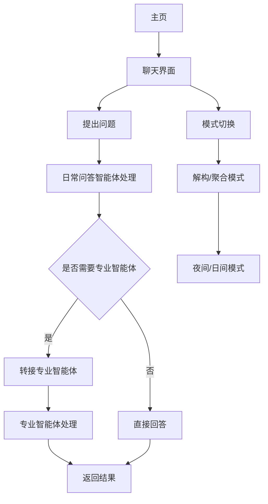

# 智能体集群系统 - 产品需求文档

## 1. 产品概览
智能体集群系统是一个由多个专业智能体组成的协作系统，通过灵活的工作流程和模型映射机制，为用户提供高质量的问题解决方案。
- 该系统旨在解决用户在学习、竞赛、科研和职业规划等方面的复杂问题，通过智能体之间的协作提供全面的支持。
- 产品价值在于通过专业化的智能体分工和协作，提高问题解决的效率和质量，同时提供透明化的协作流程。

## 2. 核心功能

### 2.1 功能模块
我们的智能体集群系统包含以下主要页面：
1. **主页**：系统介绍、核心技术展示、创新点说明。
2. **聊天界面**：智能体交互、模式切换、夜间模式。

### 2.2 页面详情
| 页面名称 | 模块名称 | 功能描述 |
|-----------|-------------|---------------------|
| 主页 | 系统介绍 | 展示智能体集群系统的整体架构和功能特点 |
| 主页 | 核心技术 | 详细介绍系统的五大核心技术：智能体集群架构、模型映射机制、ACPs协议、MCP、Skills |
| 主页 | 创新点 | 展示系统的四大创新点：双模式切换、透明化协作流程、专业化模型映射、模块化可扩展架构 |
| 聊天界面 | 智能体交互 | 与智能体集群进行对话，获取问题解决方案 |
| 聊天界面 | 模式切换 | 在解构模式和聚合模式之间切换，同时切换夜间/日间模式 |
| 聊天界面 | 消息展示 | 以美观的方式展示用户和智能体的对话内容，支持Markdown渲染 |

## 3. Core Process
用户主要操作流程如下：
1. 用户访问系统主页，了解智能体集群系统的功能和特点
2. 用户点击聊天按钮，进入聊天界面
3. 用户在聊天界面中提出问题
4. 系统首先调用日常问答智能体处理用户需求
5. 根据问题性质，系统可能会推荐转接给其他专业智能体
6. 用户可以随时切换解构/聚合模式，体验不同的协作方式
7. 用户可以查看智能体之间的协作过程，参与决策

## 4. 用户接口设计
### 4.1 设计风格
- **主色调**：蓝色和紫色渐变（#3b82f6 到 #8b5cf6），代表科技感和创新性
- **辅助色**：白色、浅灰色、深灰色，用于不同模式和背景
- **按钮风格**：圆角设计（12px-16px圆角），带有轻微的阴影和悬停效果
- **字体**：无衬线字体，清晰易读
- **布局风格**：卡片式布局，层次分明，留有适当的留白
- **图标风格**：使用Font Awesome图标，简洁现代

### 4.2 页面设计概览
| 页面名称 | 模块名称 | UI元素 |
|-----------|-------------|-------------|
| 主页 | 系统介绍 | 大型标题，简短的系统描述，配有相关图标和视觉效果 |
| 主页 | 核心技术 | 卡片式布局，每个技术点有独立的卡片，包含图标、标题和描述 |
| 主页 | 创新点 | 类似核心技术的卡片式布局，突出展示四大创新点 |
| 聊天界面 | 顶部导航栏 | 系统logo，状态指示，模式切换按钮，关闭按钮 |
| 聊天界面 | 消息区域 | 气泡式消息展示，区分用户和智能体消息，支持Markdown渲染 |
| 聊天界面 | 输入区域 | 文本输入框，发送按钮，快捷键提示 |

### 4.3 自适应
- 系统采用响应式设计，适配桌面端、平板和移动设备
- 在移动设备上，聊天界面会自动调整布局，确保良好的用户体验
- 触摸设备上的按钮尺寸会适当增大，确保易于点击

## 5. 特色功能
1. **双模式切换**：首创聚合增强与解构协同双模式，前端一键点击转换，追求速度时并行，需要深度时透明可干预。
2. **透明化协作流程**：解构协同模式全程展示任务拆解与执行过程，用户可实时追踪、参与决策。
3. **专业化模型映射**：为不同智能体分配最擅长的模型（R1/Coder/VL/通用），提升处理质量，并优化资源利用。
4. **模块化可扩展架构**：采用策略、解耦模式，模型映射与调用分离，为边缘部署和模型升级预留扩展空间。

## 6. 技术实现
- **前端框架**：React 18+
- **动画库**：Framer Motion
- **Markdown渲染**：React Markdown
- **样式**：Tailwind CSS
- **后端API**：DeepSeek API
- **智能体协作**：基于ACPs协议和MCP实现

## 7. 未来规划
- 集成实时联网搜索功能，提升知识时效性
- 增加更多专业领域的智能体
- 支持用户自定义智能体配置
- 开发移动端应用，提供更便捷的访问方式
- 增加多语言支持，拓展全球用户

## 8. 总结
智能体集群系统通过创新性的多智能体协作机制，为用户提供了一种全新的问题解决方式。系统的核心优势在于专业化的智能体分工、灵活的协作流程和透明化的用户体验，能够满足用户在学习、竞赛、科研和职业规划等多个领域的需求。